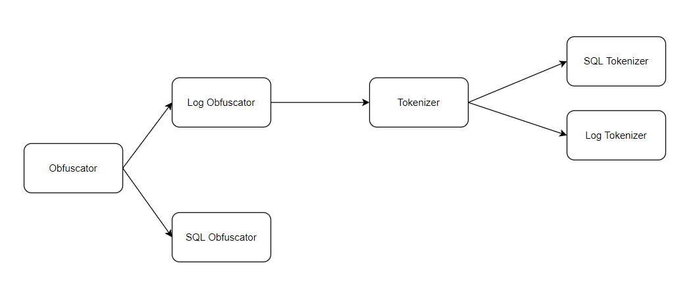

# obfuscate

### 디자인 패턴
abstrace factory pattern 사용
                                   

#### 디자인 설명
Obfuscator는 SQL, Log obfuscator가 존재할 수 있다.
scraper는 한 종류의 obfuscator만 가지기 때문에 db, log 에 따라서 다른 obfuscator를 얻는다.

각각의 obfuscator는 작업의 순서는 같지만 작업 간 서로 다른 tokenizer와 parser가 필요하다.
그렇기 때문에 각 obfuscator가 각자의 tokenizer와 parser를 가진다.

tokenizer도 추상화 할 수 있지만 그 개수가 많지 않기 때문에 obfuscator 레벨까지만 추상화한다.
